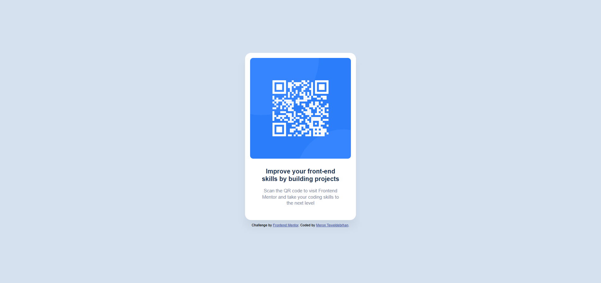

# QR Code Card Component

## Overview

This project is a simple QR code card component designed to encourage users to improve their front-end skills by visiting Frontend Mentor. The card features a QR code, a title, a description, and an attribution footer, all styled to match a clean and modern design.

### Screenshot



### Links 

- **Live Site URL:** https://qrcodemeron.netlify.app/
- **Solution URL:** [Frontend Mentor Solution](https://www.frontendmentor.io/solutions/qr-code-card-component-with-flexbox-and-responsive-design-use-htmlandcss-Tyk6q6l395)

*I've just completed a front-end coding challenge from @frontendmentor! 🎉

 

Any suggestions on how I can improve are welcome!
## My Process

### Built With

- **HTML5**: For semantic markup and structure.
- **CSS3**: For styling, including flexbox for layout and responsive design.
- **Frontend Mentor**: The challenge provider that supplied the design and assets.

### What I Learned

This project helped me strengthen my understanding of CSS layout techniques, particularly:

- Using `flexbox` to center content vertically and horizontally on the page.
- Wrapping text into multiple lines by constraining the `max-width` of elements, which also allowed me to control the height of text blocks.
- Positioning a footer at the bottom of the page using `flexbox` on the body.

```html
 <main>
<section class="card">
  
  <h1 class="card-title">Improve your front-end skills by building projects</h1>
  <p class="card-text">Scan the QR code to visit Frontend Mentor and take your coding skills to the next level</p>
</section>
</main>
```
```css
.card-title {
    font-size: 20px;
    font-weight: 700;
    margin-top: 4px;
    margin-bottom: 16px;
    color: #1f3251;
    line-height: 1.2;
    max-width: 250px;
    margin-left: auto;
    margin-right: auto;
    
}
body{
    display: flex;
    flex-direction: column;
    justify-content: center;
    align-items: center;
    height: 100vh;
    margin: 0;
    background-color: #D5E1EF;
    font-family: Arial, sans-serif;
    
}
```

  ## My Process
 
 ## Continued Development
  ### In future projects, I plan to:

* Explore more advanced CSS techniques like CSS Grid for complex layouts.
* Improve accessibility by adding ARIA labels and ensuring better contrast ratios.
* Experiment with animations to enhance the user experience, such as a hover effect on the QR code.

### Useful Resources
*MDN Web Docs - Flexbox - A comprehensive guide on using Flexbox for layouts.
* Frontend Mentor - The platform that provided the challenge and design inspiration.
* CSS Tricks - A Complete Guide to Flexbox - A quick reference for Flexbox properties.
## Author
* Name: Meron Teweldebrhan 
* Frontend Mentor Profile:(https://www.frontendmentor.io/profile/MeronTeweldebrhan)
* Website:https://meronpf.netlify.app/
* GitHub:https://github.com/MeronTeweldebrhan
## Acknowledgments
* A big thanks to Frontend Mentor for providing this challenge and the design assets.
* Shoutout to the Per Scholas Instructor Abraham E.Tavarez for his dedication to teaching and guiding us through this learning journey.
* A special thanks to my Team 4 collaborators for their amazing teamwork and support throughout this project.


